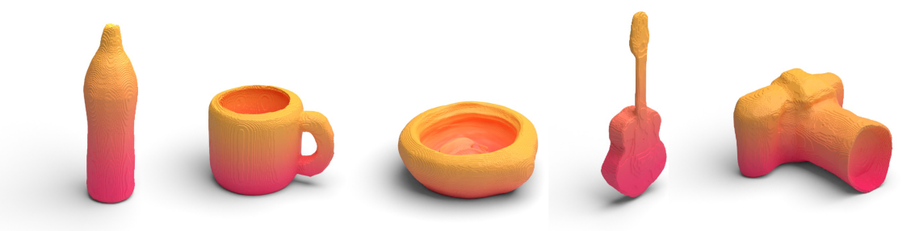
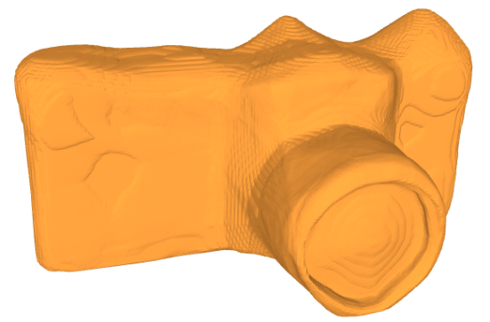
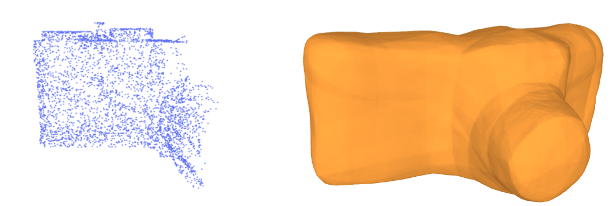
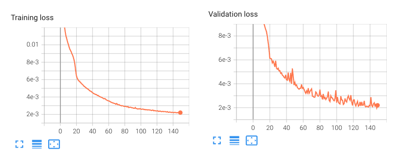

# DeepSDF
Implementation of the paper [DeepSDF: Learning Continuous Signed Distance Functions for Shape Representation](https://openaccess.thecvf.com/content_CVPR_2019/html/Park_DeepSDF_Learning_Continuous_Signed_Distance_Functions_for_Shape_Representation_CVPR_2019_paper.html). The goal if this repository is to provide a simple and intuitive implementation of the DeepSDF model that can be installed with just a single line of code. Step-to-step instructions on data extraction, training, reconstruction and shape completion are provided. Please note: this is not the official implementation. For the official implementation and citation guidelines, please refer to the [original repository](https://github.com/facebookresearch/DeepSDF).



### Why yet another repository on DeepSDF?
In comparison to other excellent repositories, this offers a few advantages:
- Minimalistic and simple implementation
- Effortless installation with a single line of code.
- Shape completion functionality

Kudos the authors of DeepSDF for their work:
```
@inproceedings{park2019deepsdf,
  title={Deepsdf: Learning continuous signed distance functions for shape representation},
  author={Park, Jeong Joon and Florence, Peter and Straub, Julian and Newcombe, Richard and Lovegrove, Steven},
  booktitle={Proceedings of the IEEE/CVF conference on computer vision and pattern recognition},
  pages={165--174},
  year={2019}
}
```
If you find this repository useful, please consider citing:
```
@misc{comi2023deepsdf,
  title={DeepSDF-minimal},
  author={Comi, Mauro},
  publisher = {GitHub},
  journal = {GitHub repository},
  howpublished={\url{https://github.com/maurock/DeepSDF/}},
  year={2023}
}
```

# Content
- [Learning resources](#learning-resources)
- [Installation](#installation)
- [Usage](#usage)
    - [Data making](#data-making)
    - [Training](#training-deepsdf)
    - [Reconstructing shapes](#reconstructing-shapes)
    - [Shape completion](#shape_completion)
- [Known Issues](#known-issues)
- [License](#license)

# Learning resources
There are many great resources to learn about DeepSDF and Neural Fields. 
- [Original DeepSDF paper](https://arxiv.org/pdf/1901.05103.pdf)
- [This notebook](https://colab.research.google.com/drive/1eWUP6g5-A0p1e6xhJYzU5dC9kegoTLwL?usp=sharing) I wrote to learn the basics of the auto-decoder framework.
- [Machine Learning for 3D Data](https://mhsung.github.io/kaist-cs492a-spring-2022/): course on Machine Learning for 3D data organised by Minhyuk Sung. DeepSDF is covered in Week 4.
- [ML for Inverse Graphics](): course taught by Vincent Sitzmann. DeepSDF is covered in Module 3.

# Installation (Mac and Linux)
These installation instructions are tested for macOS (M1) and Linux (GPU). 
```
conda create -n deepsdf python=3.10
conda activate deepsdf
```
To install all the required libraries, go to the root directory of this repository and simply run:
```
bash install.sh deepsdf
```
This script detects your OS and installs the correct dependencies. 

Please note: on macOS, the current stable pytorch3d package will be installed. On Linux this is not possible, as the correct combination of Python, Pytorch, Pytorch3D, and CUDA versions depends on your system (OS and GPU). Therefore, the `install.sh` downloads the following combination: `pytorch=1.11.0, cudatoolkit=11.3, pytorch3d=0.7.4`. If you prefer a different combination, or this combination of dependencies does not work on your system, please edit `install.sh` accordingly, or manually install your preferred libraries.

# Installation (Windows)
COMING SOON. Currently the installation script does not support Windows, please install the dependencies manually.

# Usage
## Quick example with a pretrained model
The next sections explain how to create a dataset, train a model, and reconstruct or complete shapes. Here we just provide a minimal example with a small pretrained model:

**Reconstruct shapes with latent code optimised at training time**

Set **`config_files/reconstruct_from_latent.yaml`** as follows:
```
# Config file for reconstructing objects from latent code

folder_sdf: '17_07_172540'
obj_ids: ['02942699/5d42d432ec71bfa1d5004b533b242ce6']
resolution: 256
```
Run:
```
python scripts/reconstruct_from_latent.py
```
In `results/runs_sdf/<TIMESTAMP>/meshes_training/` you should see your reconstructed `.obj` file. Visualise it with any graphics library or [Online 3D Viewer](https://3dviewer.net/).



**Shape completion**
Set **`config_files/shape_completion.yaml`** as follows:
```
folder_sdf: '17_07_172540'   
obj_ids: '02942699/5d42d432ec71bfa1d5004b533b242ce6'
resolution: 256

# Visible bounding box for shape completion
x_axis_ratio_bbox: 1
y_axis_ratio_bbox: 0.5
z_axis_ratio_bbox: 1

# Inference parameters
epochs: 10000 
lr: 0.00001
lr_scheduler: True   
lr_multiplier: 0.9
patience: 100
sigma_regulariser: 0.01
clamp: True
clamp_value: 0.1
```
Run:
```
python scripts/shape_completion.py
```
The result is stored in `results/runs_sdf/<TIMESTAMP>/infer_latent_<TIMESTAMP>/`


## Data making
The dataset in this repository already contains three shapes from ShapeNetCoreV2. To train on more shapes, please download the ShapeNetCoreV2 datset from the [official website](https://shapenet.org/) and copy its content under `data/ShapeNetCoreV2`. The following format is required:
```
root
 ├── data
 │   ├── ShapeNetCoreV2
 │   │   ├── 02942699 
 |   |   |   ├── 1ab3abb5c090d9b68e940c4e64a94e1e
 |   |   |   |   ├── models
 |   |   |   |   |   ├── model_normalized.obj
 ...
```
To extract the SDF values required to train DeepSDF, simply set the number of samples to generate in `config_files/extract_sdf.yaml` and run:
```
python data/extract_sdf.py
```
This script automatically converts the mesh into a watertight mesh prior to data collection. Moreover, in Shapenet the front of the object is aligned with -Z axis. Before extracting the samples, we rotate the object to align it with the canonical reference frame using `utils_mesh.shapenet_rotate()`.

The collected data is stored in:
- `results/samples_dict_ShapeNetCore.npy`: dictionary containing collected samples and corresponding SDF values per shape.
- `idx_int2str_dict.npy`: dictionary mapping object numerical indexes to corresponding ShapeNet category/synset.
- `idx_str2int_dict.npy`: dictionary mapping ShapeNet category/synset to object numerical indexes.


## Training DeepSDF
Configure the training parameters in `config_files/train_sdf.py` and run:
```
python model/train_sdf.py
```
This trains the surface prediction model. The model weights and additional results are stored under `results/runs_sdf/<TIMESTAMP>`.

To visualise the training curves, use Tensorboard:
```
cd results
tensorboard --logdir `runs_sdf`
```



## Reconstructing shapes
The latent codes optimised at training time are stored in `results/runs_sdf/<TIMESTAMP>/results.npy`. If you want to reconstruct the shapes using the trained DeepSDF model and the latent codes optimised at training time, set `config_files/reconstruct_from_latent.yaml`. The possible `obj_ids` to reconstruct are those available in `data/ShapeNetCoreV2`, e.g. `02942699/6d036fd1c70e5a5849493d905c02fa86`. 

Then, simply run:
```
python scripts/reconstruct_from_latent.py
```
The folder `meshes_training` is created under the corresponding `results/runs_sdf/<TIMESTAMP>/` and the reconstructed `.obj` files are stored. You can visualise `.obj` files using [Online 3D Viewer](https://3dviewer.net/), Blender, Trimesh, or any graphics library.

## Shape Completion
DeepSDF can reconstruct shapes when provided with partial pointclouds of the object's surface. This is achieved by leveraging the auto-decoder framework, which infers the latent code that best describes the provided pointcloud at test-time. 

To extract and predict the mesh geometry from a partial pointcloud, set `config_files/shape_completion.yaml`. Here' an example of parameters for pointcloud extraction:
```
x_axis_ratio_bbox: 0.5   
y_axis_ratio_bbox: 1
z_axis_ratio_bbox: 1
```
This configuration selects points along 50% of the x-axis, the entire y-axis, and the entire z-axis.

Additionally, you can configure the hyperparameters for latent code inference.

Please note: before extracting the pointcloud, remember to rotate the mesh using the provided method `utils_mesh.shapenet_rotate(original_mesh)`. This method makes sure to align the object to our canonical reference frame. The partial pointcloud generation is handled by the method `scripts/shape_completion.py -> generate_partial_pointcloud(cfg)`. Edit this function for custom data extraction. 

# Known issues
- Finding a matching combination of Pytorch, Pytorch3D, CUDA version, and hardware is tricky. If you encounter compatibility issues when installing Pytorch3D on Linux, please refer to `https://github.com/facebookresearch/pytorch3d/blob/main/INSTALL.md`.

# TODO

- [ ] Add support fo quick install on Windows

# License
DeepSDF is relased under the MIT License. See the [LICENSE file](LICENSE) for more details.
